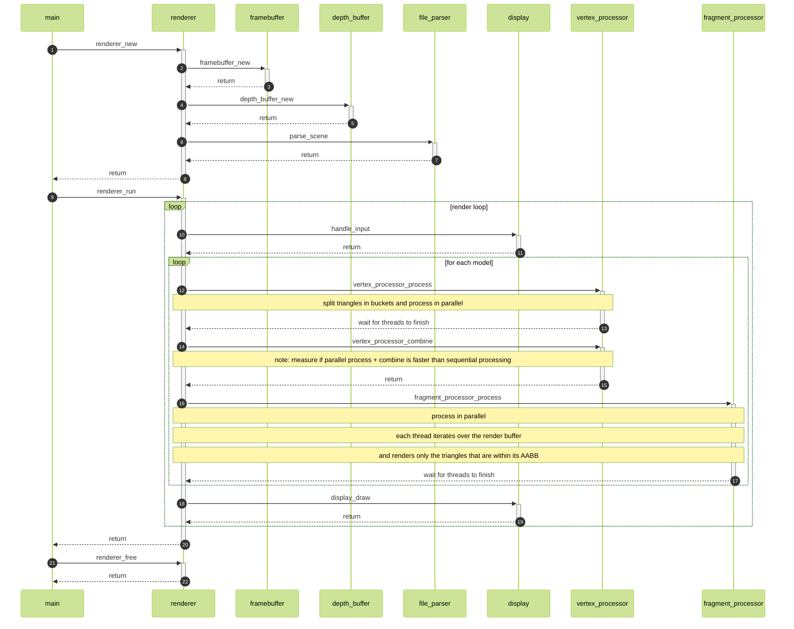

 

# PBR Software Renderer

TODO: nice description

## Features

- GLB(glTF) parser
    - JSON parser
    - PNG parser with DEFLATE decoder

## References

The references are pretty much the same ones listed in the [Phong Software Renderer](https://github.com/marsp0/phong-software-renderer) and can be found [here](https://github.com/marsp0/software-renderer/wiki/References).

## Code flow

the below diagram shows how the execution of the program flows

